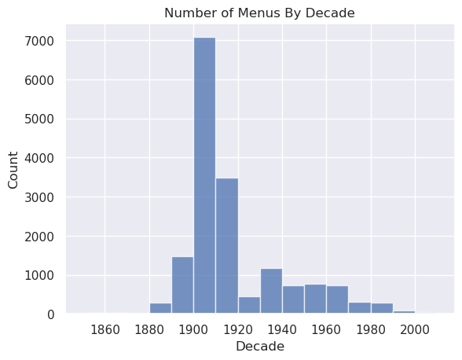
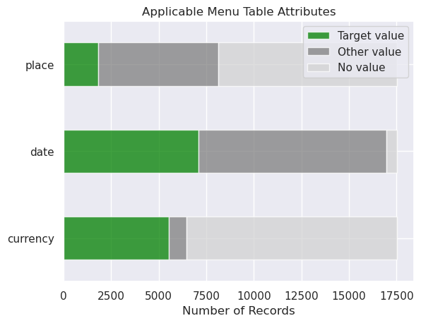
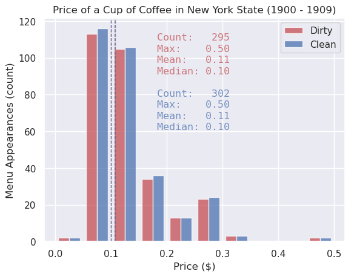

# Coffee

## Goals

Answer the following questions:

1. What was the price of a cup of coffee in the state of New York between 1900 and 1909?
2. How much does data cleaning on the source dataset change the answer to the first question?

## Dataset

### Summary

[What’s on the Menu?](https://menus.nypl.org/) is a project to transcribe The New York Public Library’s restaurant menu collection. The collection contains menus from around the world, stretching from the 1850s to the 2000s.

### Tables

The dataset contains four tables with the following relationships.


Credit: @monsieur-le-git

### Exploration

The first target question is tuned to the data available in the dataset.





## Workflow


## Cleaning

| Table    | Attribute   | Change |
| -------- | ----------- | ------ |
| Menu     | date        | Trim leading and trailing whitespace |
| Menu     | call_number | Trim leading and trailing whitespace |
| Menu     | place       | Trim leading and trailing whitespace |
| Menu     | currency    | Trim leading and trailing whitespace |
| MenuItem | price       | Trim leading and trailing whitespace |
| Dish     | name        | Trim leading and trailing whitespace |
| Menu     | date        | Set empty dates to year from `call_number` |
| Menu     | date        | Repair typos observed in manual data exploration |
| Menu     | place       | Repair misspellings of "New York" |
| Menu     | currency    | Repair misspellings of "Dollars" |
| Menu     | currency    | Change instances of "Cents" to "Dollars" (communize US currency) |
| MenuItem | price       | Divide by 100 (`Menu` `currency` changed from "Cents" to "Dollars") |
| Dish     | name        | Repair misspellings of "Coffee" |

## Results

### Price of a Cup of Coffee


### Impact of Data Cleaning

The goal of data cleaning is to increase the number of records from the menu and dish tables that meet the target value for every applicable attribute.


## Creating the Project Environment

```sh
conda env create -f environment.yml
conda activate coffee
```

## Running the Project

### Exploration

```sh
python src/explore.py /path/to/dataset
```

### Cleaning and Query

```sh
python src/main.py /path/to/dataset
```

## Testing the Project

```sh
mypy src/*.py
python -m unittest discover -s src
```
